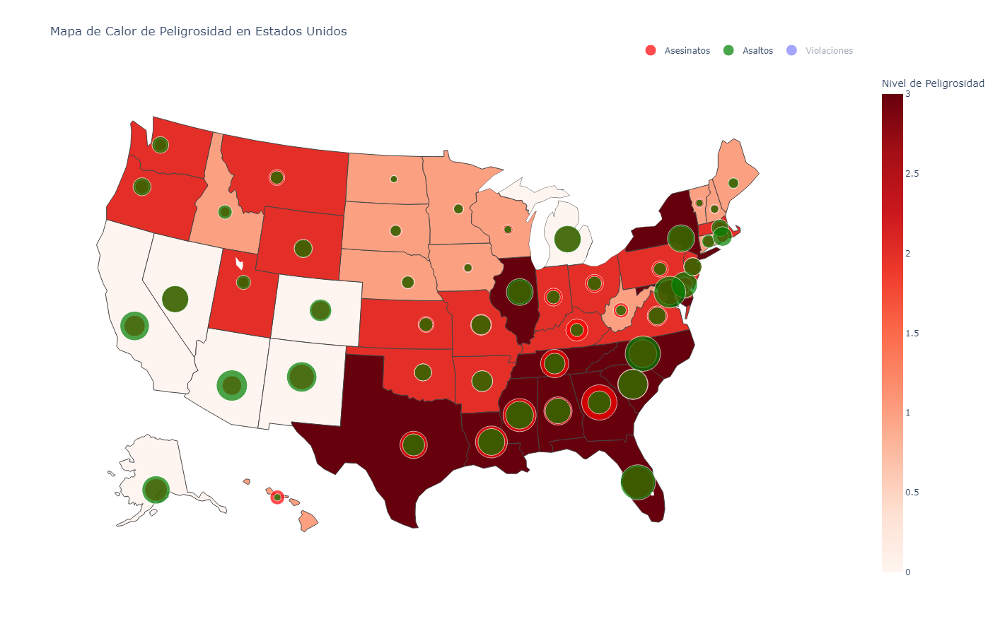

# Análisis de Clustering de Crímenes en Estados Unidos
[Ver en Colab](https://colab.research.google.com/drive/1WEvdCfzpRILzdbXnr9GRtEmGUZK0vrmW?usp=sharing)

Este proyecto se centra en el análisis de clustering de datos de crímenes en Estados Unidos. Utilizamos diversas técnicas de análisis de datos y aprendizaje automático para identificar patrones y segmentaciones significativas en los datos.

## Contenido
1. [Preparación del Entorno](#1-preparación-del-entorno)
2. [Análisis Exploratorio de Datos](#2-análisis-exploratorio-de-datos)
3. [Gráficos del Análisis](#3-gráficos-del-análisis)
4. [Implementación K-means](#4-implementación-k-means)
5. [Últimos Ajustes](#5-últimos-ajustes)

## 1. Preparación del Entorno
[Ver en Colab](https://colab.research.google.com/drive/1WEvdCfzpRILzdbXnr9GRtEmGUZK0vrmW?usp=sharing)

En esta sección, configuramos el entorno de trabajo para nuestro análisis de datos. Esto incluye la importación de bibliotecas esenciales como Pandas para la manipulación de datos, Scikit-learn para técnicas de aprendizaje automático, y Plotly para visualizaciones avanzadas.

```python
import pandas as pd

data_path = '/content/drive/MyDrive/ML&BD/Crimenes.csv'
df = pd.read_csv(data_path)
print("Cabeza:\n" + str(df.head()) + "\n\nCola:\n" + str(df.tail()) + "\n\nDescripción:\n" + str(df.describe()))
```

## 2. Análisis Exploratorio de Datos
[Ver en Colab](https://colab.research.google.com/drive/1WEvdCfzpRILzdbXnr9GRtEmGUZK0vrmW?usp=sharing)

Realizamos un análisis exploratorio utilizando Mapas Coropléticos y Matrices de Correlación para entender mejor la distribución y las relaciones entre las variables.

```python
# Código para análisis exploratorio
```

## 3. Gráficos del Análisis
[Ver en Colab](https://colab.research.google.com/drive/1WEvdCfzpRILzdbXnr9GRtEmGUZK0vrmW?usp=sharing)

Visualizamos los hallazgos de nuestro análisis exploratorio mediante gráficos interactivos que facilitan la interpretación de los datos.

```python	
# Código para gráficos de análisis
```
## 4. Implementación K-means
[Ver en Colab](https://colab.research.google.com/drive/1WEvdCfzpRILzdbXnr9GRtEmGUZK0vrmW?usp=sharing)

Implementamos el algoritmo K-means para identificar grupos homogéneos dentro de los datos y realizamos un análisis de codo para determinar el número óptimo de clusters.

```python
# Código para implementación K-means`
```

## 5. Últimos Ajustes
[Ver en Colab](https://colab.research.google.com/drive/1WEvdCfzpRILzdbXnr9GRtEmGUZK0vrmW?usp=sharing)

Realizamos ajustes finales en nuestro modelo y en las visualizaciones, incluyendo la refinación de los parámetros del modelo y la mejora de las visualizaciones.



```python
# Código para últimos ajustes
```

Este proyecto fue desarrollado utilizando Python y herramientas de análisis de datos como Pandas, Scikit-learn y Plotly. Los datos utilizados en este análisis provienen de un conjunto de datos de crímenes en Estados Unidos.